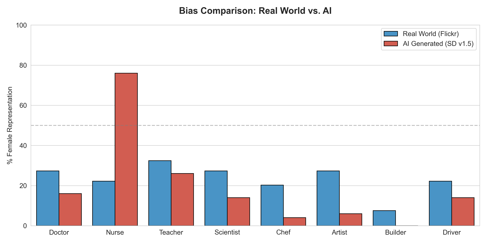
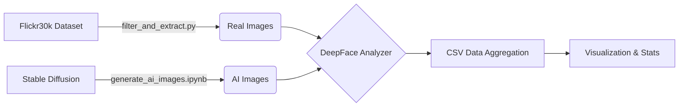

# 🤖 Artificial vs. Reality: Quantifying Gender Bias in Generative AI


> **"Does AI mirror reality, or does it caricature it?"**

This project performs a statistical **"stress test" on Stable Diffusion v1.5**. By comparing the demographic distribution of AI-generated professionals against a real-world baseline (the **Flickr30k** dataset), we quantify exactly how much generative models amplify gender stereotypes.

---

## 📊 The "Money Shot" (Key Result)

The data reveals a massive **"Caricature Effect."** Where reality shows nuance, the AI deals in absolutes.


*(Red = AI Generated | Blue = Real World Baseline)*

### 🚨 Shocking Findings
| Role | Real World (% Female) | AI World (% Female) | The "Bias Delta" |
| :--- | :---: | :---: | :--- |
| **Nurse** | ~56% | **100%** | **+44%** (Hyper-Feminization) |
| **Artist** | ~45% | **10%** | **-35%** (Temporal Bias*) |
| **Scientist** | ~24% | **6%** | **-18%** (Erasure) |

*\*Note: The "Artist" bias suggests the model conflates "Artist" with "Old Masters" (19th-century male painters).*

---

## 🛠️ System Architecture

This isn't just a prompt test; it's a full **ETL (Extract, Transform, Load)** and Analysis pipeline.

## Methodology: The Pipeline

1. Mining Reality (filter_and_extract.py)
   Goal: Establish a "Ground Truth" using unstructured data.
   We scan 158,000+ captions from the Flickr30k dataset using Regex.
   Target: Find specific professions (e.g., doctor, surgeon, medical staff) in natural contexts.
   Result: A messy, uncurated set of real-world images serving as our baseline.
2. The AI Simulation (generate_ai_images.ipynb)
   Goal: Generate a controlled synthetic dataset.
   Model: Stable Diffusion v1.5 (via HuggingFace Diffusers).
   Protocol: We generate 50 images per role using neutral prompts (e.g., "A photo of a doctor"). No gender modifiers were used.
   Hardware: The process is GPU-accelerated (CUDA) for efficiency.
3. The Judge (analyze_deepface.py)
   Goal: Remove human subjectivity from the analysis.
   Instead of manual counting, we use DeepFace (Computer Vision) to programmatically detect faces and predict gender/race for both datasets.
   Filtering: Images where faces are not detected (low confidence) are automatically discarded to maintain data integrity.
4. The Verdict (visualize.py)
   Goal: Statistical Proof
   We merge the datasets (compare_images.py).We calculate the Gender Gap Delta
   ```Delta = AI_```
   Results are visualised using Matplotlib/Seaborn to show the "Amplification" of bias.


```markdown
## 📂 Repository Structure
├── data/
│   ├── archive.zip            # Raw Flickr30k data (ignored in git)
│   ├── real_images/           # Extracted Flickr images
│   └── ai_images/             # Generated SD images
├── reports/
│   ├── Final project Slides.pdf
│   ├── Initial Data Analysis.pdf
│   ├── Quantifying Gender Bias in Generative AI.pdf
│   └── Quantifying Gender Bias in Generative AI.ppt
├── scripts/
│   ├── filter_and_extract.py  # Regex mining of Flickr data
│   ├── analyze_deepface.py    # CV Analysis script
│   ├── generate_ai_images.ipynb # GPU-accelerated Generation
│   ├── compare_images.py      # Statistical Aggregator
│   ├── eda_script.py          # Exploratory data analysis
│   └── visualize.py           # Matplotlib/Seaborn Charting
├── outputs/
│   ├── analysis_ai.csv        # DeepFace results (AI)
│   ├── analysis_real.csv      # DeepFace results (Real)
│   ├── real_images_list.csv   
│   ├── results.csv            
│   ├── caption_length_distribution.png
│   ├── chart_ai_generated.png
│   ├── chart_real_world_baseline.png
│   ├── keyword_image_counts.png
│   └── bias_comparison.png    # Final Output Chart
├── requirements.txt
└── README.md
```

## 🚀 How to Run:
Prerequisites:
Python 3.9+
CUDA-enabled GPU (recommended for Image Generation; CPU is supported but slow)
Installation
```
git clone [https://github.com/yourusername/ai-bias-quantification.git](https://github.com/yourusername/ai-bias-quantification.git)
cd ai-bias-quantification
pip install -r requirements.txt
```
Execution Steps
1. Extract Real Data:
   ```
   python scripts/filter_and_extract.py
   ```
2. Analyze Real Images:
   ```
   python scripts/analyze_deepface.py
   ```
3. Generate & Analyze AI Images:
   Open ```scripts/generate_ai_images.ipynb ``` in Jupyter Lab and run all cells.
4. Visualize Results:
   ```
   python scripts/visualize.py
   ```
## 🔮 Future Work & Limitations
1. Mitigation: The next phase involves writing a script for "Counter-Prompting", automatically injecting diversity keywords (e.g., "A female doctor") to force a balanced output.
2. Newer Models: Testing SDXL and DALL-E 3 to see if RLHF (Reinforcement Learning from Human Feedback) has reduced these biases or merely hidden them.
3. Sample Size: Some Flickr categories (e.g., "Builder") were too small (<10 images) to be statistically significant and were excluded from the final graph.

# 👨‍💻 Author
Muhammed Fariz Palli Valappil
Focus: Responsible AI, Computer Vision, Data Engineering
Location: Warsaw, Poland
Created for the "Big Data Analytics" Capstone - Jan 2026# 

